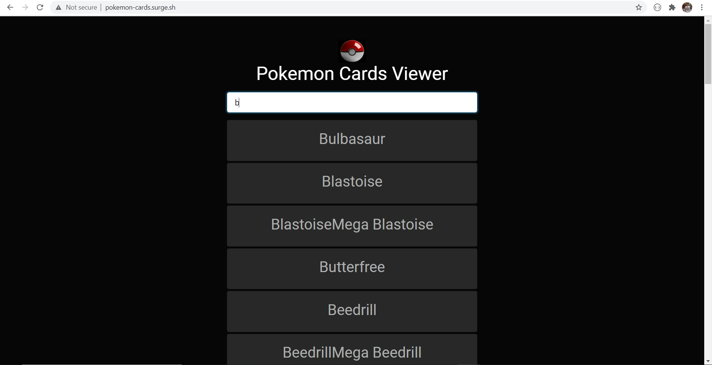
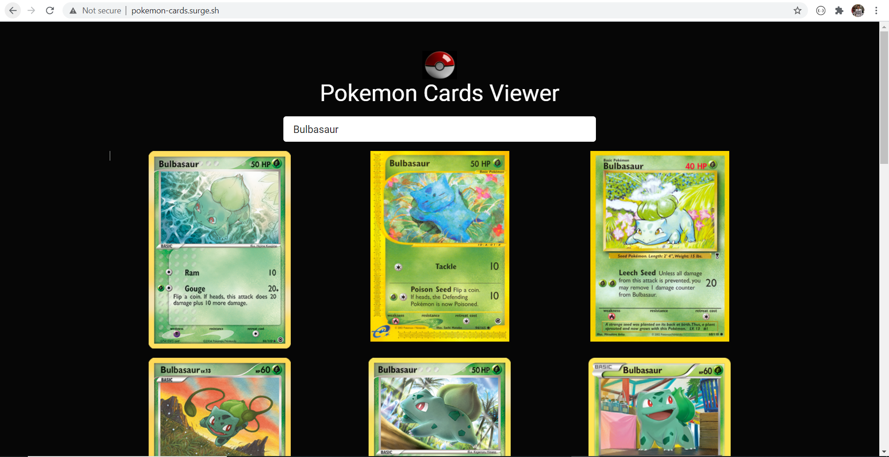

# Pokemon Cards Viewer 

A simple static application to view Pokemon Cards for different Pokemons. You can search for cards of your favourite Pokemon using the text input which is powered by a javascript based AutoCompletion and retrieve the cards.

Following API is used to retrieve card images:
[Pokemon TCG](https://pokemontcg.io/)

---

## Sample  Images

### 1. AutoComplete Pokemon names

### 2. Pokemon Cards View

---

## Deployment

Deploy application to CDN using surge.

Application hosted on:
[Pokemon Cards Viewer](http://pokemon-cards.surge.sh)

